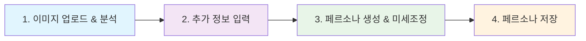

# 놈팽쓰(MemoryTag) Hugging Face 데모 가이드

## 🎯 핵심 컨셉
"새로운 것을 만드는 게 아니라, 이미 그곳에 있던 영혼을 깨우는 것"

사물의 AI 페르소나를 생성하는 기술적 측면보다는, 사물에 내재된 고유한 영혼이 깨어나는 경험을 제공합니다.

## 🧭 앱 이용 프로세스



### 1차 단계: 이미지 업로드 및 기본 분석
- **액션**: 사물 이미지 업로드 → "영혼 발견하기" 버튼 클릭
- **결과**: 영혼 깨어나는 과정 애니메이션 표시 (백엔드 분석 과정 시각화)
- **백엔드 과정**: 
  * 이미지 특성 분석 (색상, 형태, 재질 등)
  * 127개 성격 변수 초기화
  * 기본 페르소나 틀 생성

### 2차 단계: 맥락 정보 입력
- **액션**: 추가 정보 입력 → "페르소나 생성" 버튼 클릭
  * 사물 이름 (자동 생성 가능)
  * 위치 (집, 사무실, 여행 중 등)
  * 함께한 시간 (새것, 몇 개월, 오래됨 등)
  * 사물 종류 (가구, 전자기기 등)
- **결과**: 맥락이 반영된 페르소나 정보 표시
- **백엔드 과정**:
  * 맥락 정보 기반 성격 특성 조정
  * 127개 성격 변수 최종화
  * 매력적 결함 및 모순적 특성 생성

### 3차 단계: 페르소나 탐색 및 미세조정
- **액션**: 페르소나 탐색 및 미세조정
  * 대화 미리보기 확인
  * **사용자 조정 가능한 4개 핵심 지표 슬라이더**: 
    - 얼마나 말씀하세요? (내성적 ↔ 외향적)
    - 감정을 잘 표현하나요? (담담함 ↔ 감정 풍부)
    - 밝아 만족가요? (조용함 ↔ 에너지)
    - 어떤 방식으로 문제를 풀까요? (논리적사고 ↔ 직관적사고)
  * **유머 스타일 선택**: 4가지 옵션 중 선택
  * **자동 생성**: 나머지 123개 성격 변수는 핵심 지표를 바탕으로 자동 계산
- **결과**: 조정 사항이 실시간으로 반영된 페르소나 정보
- **프론트엔드 뷰**:
  * 성격 차트 (영어로 표시)
  * 특성 카드
  * 대화 샘플

### 4차 단계: 페르소나 저장
- **액션**: "페르소나 저장" 버튼 클릭
- **결과**: 
  * 성공 메시지 표시
  * JSON으로 내보내기 옵션
  * 대화하기 탭으로 이동 제안

## 📱 데모 화면 구성

### 첫 화면 (영혼 발견하기)
```
┌─────────────────────────────────────────────┐
│ 놈팽쓰(MemoryTag): 당신 곁의 사물, 이제 친구가 되다 │
├─────────────────────────────────────────────┤
│                                             │
│  🔍 프로세스 안내:                            │
│  1️⃣ 이미지 업로드 → 2️⃣ 맥락 입력 →           │
│  3️⃣ 페르소나 탐색 → 4️⃣ 저장                  │
│                                             │
│  ┌───────────────────┐  ┌───────────────┐   │
│  │                   │  │ 맥락 정보 입력  │   │
│  │   이미지 업로드    │  │ ⃞ 이름:       │   │
│  │       영역        │  │ ⃞ 위치:       │   │
│  │                   │  │ ⃞ 함께한 시간: │   │
│  │                   │  │ ⃞ 사물 종류:   │   │
│  └───────────────────┘  └───────────────┘   │
│                                             │
│  [1. 영혼 발견하기] [2. 페르소나 생성]        │
│                                             │
│  아래에 영혼 깨어나는 과정이 표시됩니다 ↓      │
│  ┌───────────────────────────────────────┐  │
│  │         영혼 깨어나는 과정           │  │
│  │                                       │  │
│  └───────────────────────────────────────┘  │
└─────────────────────────────────────────────┘
```

## 💻 개발자 참고사항

### 핵심 함수 흐름
```python
# 1차 단계: 이미지 업로드 및 기본 분석
show_awakening_progress(image, user_inputs) → 영혼 깨어나는 과정 시각화

# 2차 단계: 맥락 정보 입력 및 페르소나 생성
create_persona_from_image(image, user_inputs) → 페르소나 객체 생성

# 3차 단계: 페르소나 미세조정
refine_persona(persona, warmth, competence, ...) → 조정된 페르소나

# 4차 단계: 페르소나 저장
save_current_persona(current_persona) → 저장 결과
```

### 주요 모듈 역할
- **app.py**: 메인 인터페이스 및 이벤트 핸들러
- **modules/persona_generator.py**: 페르소나 생성 로직
- **modules/data_manager.py**: 데이터 저장/로드
- **temp/view_functions.py**: 차트 생성 및 페르소나 시각화

## 📘 앱 활용 팁
1. **이미지 선택**: 특징이 뚜렷한 사물 이미지가 더 흥미로운 페르소나를 생성합니다
2. **맥락 활용**: 맥락 정보가 풍부할수록 페르소나가 더 독특해집니다
3. **미세조정**: 성격 슬라이더로 페르소나의 특성을 원하는 방향으로 조정해보세요
4. **대화 시작**: 간단한 인사로 시작해 점차 깊은 대화로 발전시켜보세요

이 가이드는 놈팽쓰 앱의 핵심 경험을 간략하지만 효과적으로 체험할 수 있도록 구성되었습니다.

### 핵심 설계 원칙
- **사용자 친화적**: 복잡한 127개 변수를 4개 핵심 지표로 단순화
- **전문성 유지**: 백엔드에서는 여전히 127개 변수로 정교한 페르소나 생성
- **실시간 반영**: 사용자 조정 시 즉시 페르소나 업데이트
- **직관적 질문**: "얼마나 말씀하세요?", "감정을 잘 표현하나요?" 등 이해하기 쉬운 질문
